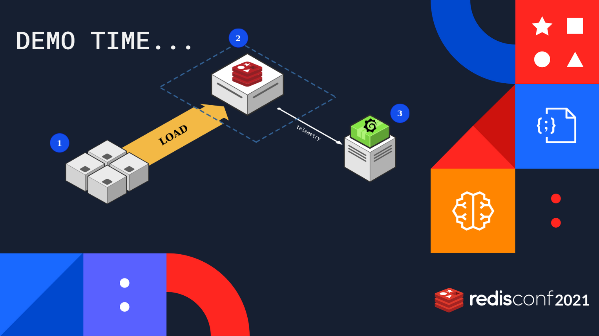

# redisconf21-how-to-benchmark-redis-demo



RedisConf 2021 How to benchmark Redis demo by Filipe And Or. To follow along with these examples, you'll need access to an AWS account and to follow the next steps.

## Step 1 deploy infra

To deploy the required infra you need `ansible`, and `terraform` available on your local system, and to have configured your AWS credentials.
You are expected to have your private for deployment located at `/tmp/redisconf-demo.pem` . ( You can also change the terraform var named `private_key`).

If you have both, do as follows:
```
./ansible-setup.sh
cd infra
terraform init

# confirm that you will have 3 VMs deployed
terraform plan

# Deploy the required infra
terraform apply
> type yes

# Check the outputed vars
```

The automation will deploy and configure the required VMs ( With Grafana, prometheus, prometheus-exporter,... ).

At the end, you should have output vars similar to:
```
client_private_ip = [
  "10.3.0.66",
]
client_public_ip = [
  "3.137.199.62",
]
database_private_ip = [
  "10.3.0.91",
]
database_public_ip = [
  "18.218.67.22",
]
grafana_server_public_ip = [
  "18.191.195.146",
]
```
Save that info because you will need those internal and external IP addresses for the next steps and during the benchmark.

## Step 2 Configure Grafana Redis Plugin

You can install grafana redis datasource using grafana-cli within the grafana VM
```
# ssh into grafana machine
# then execute the following
grafana-cli plugins install redis-datasource
```

For how to configure take a look at https://grafana.com/grafana/plugins/redis-datasource/ :)

## Step 3 Follow along and fill-in the sample report

Within the `demo-report.pdf` file, you have some sample pre-benchmark steps, benchmark commands, and expected info to be stored when producing a sample benchmark report.

Use the external IP adress to connect to the DB and CLIENT machines and follow every step on the doc.

If you have any doubts, please shared them as
issues on the repo. [>>SHARE DOUBT<<](https://github.com/filipecosta90/redisconf21-how-to-benchmark-redis-demo/issues/new).
